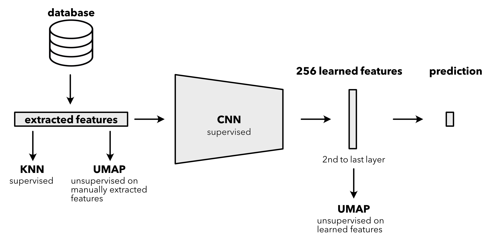

# UMAP

## Exercise: Supervised and Unsupervised Machine Learning Methods for Urban Sound dataset

<p align="center">
    
</p>
<p align="center" style="font-size: 0.8em;">
    <b>Workflow for urban sound classification using KNN and CNN classifiers, including UMAP-based feature visualization.</b>
</p>

In this exercise, we will apply supervised and unsupervised machine learning techniques to classify urban sounds using the UrbanSound8K dataset. After extracting features from audio files, we will train a K-Nearest Neighbors (KNN) classifier and visualize the data using UMAP (Uniform Manifold Approximation and Projection). Next, we will use the same features to train a Convolutional Neural Network (CNN) and compare its performance to KNN. UMAP will also be used to visualize one of the CNN's last layers.

## Table of Contents
- [Installation](#installation)
- [Dataset to download](#dataset-to-download)
- [Resources](#resources)
- [Credits](#credits)

### Installation

0. (Optional) Create a conda environment for the exercise. This is not necessary, but it is a good practice to keep your packages organized and avoid version conflicts.

```bash
conda create --name ai4seis python=3.10
conda activate ai4seis
```

1. Install the required packages:

```bash
pip3 install torch torchvision torchaudio pandas numpy matplotlib seaborn librosa scikit-learn tqdm umap-learn datamapplot

pip3 install ipywidgets widgetsnbextension
```

2. Download the UrbanSound8K dataset by following [Dataset to download](#dataset-to-download) section. Unzeip the dataset and place it in the `./data` folder. The folder structure should look like this:

```bash
AI4Seismology
├── README.md
├── data                           # Data folder, where the UrbanSound8K dataset is stored
│   ├── UrbanSound8K.csv
│   ├── fold1
│   ├── fold2
│   ├── ...
│   ├── fold9
│   └── fold10
├── images
│   └── concept.png
└── notebooks                      # Jupyter notebook for the exercise
    ├── ML_UrbanSound8K.ipynb      # Main notebook, follows the steps of the exercise
    ├── audio_processing.py        # Audio processing functions
    ├── config.py                  # Configuration file, where the parameters for the exercise are stored
    ├── data_utils.py              # Data loading and preprocessing functions
    └── model_utils.py             # Model training and evaluation functions
```


### Dataset to download

In this exercise, we will use the UrbanSound8K dataset. This dataset is a collection of urban sound recordings that can be used for sound classification tasks. It contains 8,732 labeled sound excerpts (<=4s) of urban sounds from the following 10 classes:

 - air_conditioner
 - car_horn
 - children_playing
 - dog_bark, drilling 
 - enginge_idling
 - gun_shot
 - jackhammer
 - siren
 - street_music 

The classes are drawn from the urban sound taxonomy. For a detailed description of the dataset and how it was compiled please refer to [Salamon et. al, 2014](https://www.justinsalamon.com/uploads/4/3/9/4/4394963/salamon_urbansound_acmmm14.pdf). 

All sound excerpts are taken from field recordings uploaded to [Freesound](https://www.freesound.org/). The dataset is divided into 10 folds, which can be used for cross-validation. 

In addition to the sound excerpts, a CSV file containing metadata about each excerpt is also provided.

The dataset can be downloaded from [Kaggle](https://www.kaggle.com/datasets/chrisfilo/urbansound8k):

- https://www.kaggle.com/datasets/chrisfilo/urbansound8k?resource=download

#### Why this dataset in AI4Seismology?

We are using the UrbanSound8K dataset for this exercise because it is a well-established benchmark for urban sound classification. The dataset contains a diverse range of urban audio recordings that are already labeled, allowing us to work efficiently without needing to spend time on data collection or annotation.

At approximately 6 GB, UrbanSound8K is a manageable size for most computers, making it practical for quick experimentation and model iteration. Its diversity and structure enable us to test and compare various machine learning techniques, including supervised and unsupervised approaches.

Additionally, experience gained with UrbanSound8K is applicable to other sound-related projects, such as seismology using signals from whales, ships, lions, elephants, Taylor Swift concerts or other soundscapes.

### Resources

Here are two links for unsupervised methods for visualisation, which I find quite helpful:

- https://pair-code.github.io/understanding-umap/
- https://projector.tensorflow.org/

### Credits

This exercise is based on the [UrbanSound8K dataset](https://www.kaggle.com/datasets/chrisfilo/urbansound8k), and the code examples were taken from:

 - https://www.kaggle.com/code/emperorpein/sound-classificaiton
 - https://www.kaggle.com/code/papeloto/urban-sound-feature-extraction-knn